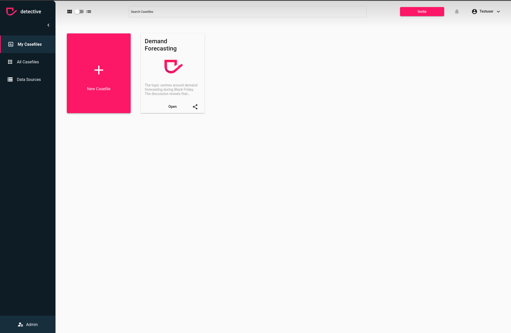

# Learn how to connect a database to detective
With detective you can use nearly every important database. To be able to add, update or delete a databases in your
detective account you need to make sure you have admin rights.

### Prerequisites
The following points must be true:
1. Your account need administrator rights to your detective instance. If you created the detective instance you will have the admin rights by default. If you don't have admin rights ask your admin to change the subscription or ask the admin to upgrade your permissions in the [User](./users) section
2. You need to be logged in to [detective](https://detective.solutions/login).

### Navigate to the connections
To create, update or delete a database in your detective instance you need to navigate to `Connections` in your
admin Subpage

