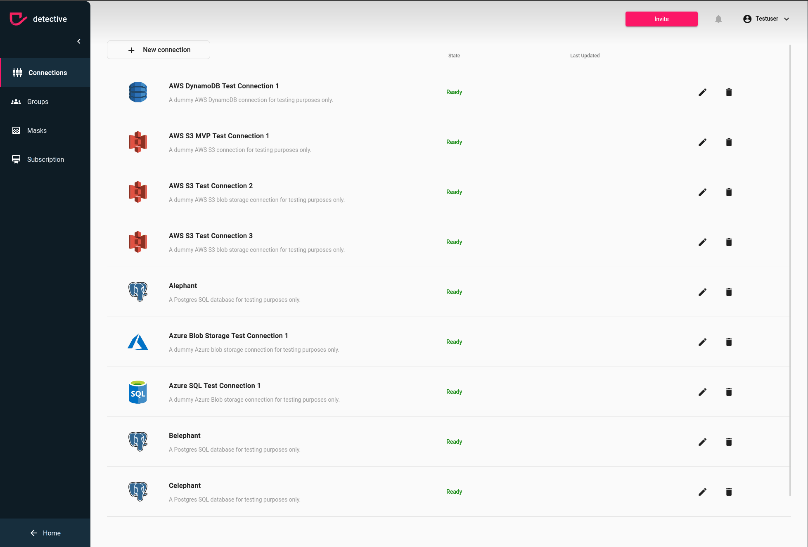

# Add a Database
Before working with data you need data to work with. First you need to ensure the [prerequisites](../connections.html). 
If you want to connect a database to your detective instance need to press the `New Connection` button at the left top.
After clicking the button a modal will open which allows you to specify the database connection you want to create.

1. [Navigate to your Connections](../connections.html)
2. Click on the `New Connection` button on the left top side
3. Choose a connector type from the list

Once you selected a connector the modal with give you a lot of options specific for the selected connector. If you
need some help with the configuration make sure to check out our detailed guides for each of them:

