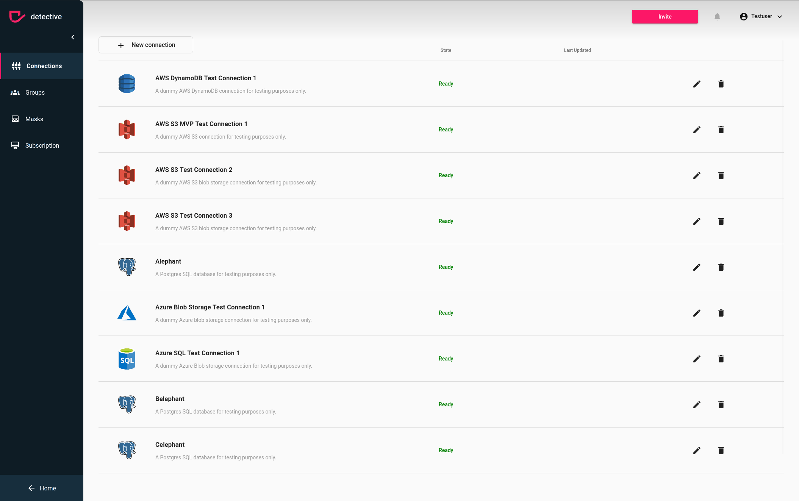

# The PostgreSQL connector 

The PostgreSQL connector allows querying tables in an external [PostgreSQL](https://www.postgresql.org/) database.
This can be used to join data between different systems like PostgreSQL and Hive, or between different PostgreSQL instances.
PostgreSQL belongs to the structured databases.

### Requirements

To use this connector the following things must be given:
- PostgreSQL 10.x or higher ([How to check the version of your postgreSQL](https://stackoverflow.com/questions/13733719/which-version-of-postgresql-am-i-running)).
- Network access from detective to PostgreSQL. Port 5432 is the default port.

### Configuration

The connector can query a database on a PostgreSQL server. To create a connection you need to select the postgreSQL
connector in your new connection modal:

After doing need to fill at least the following required fields:
1. 

### Multiple PostgreSQL databases or servers

