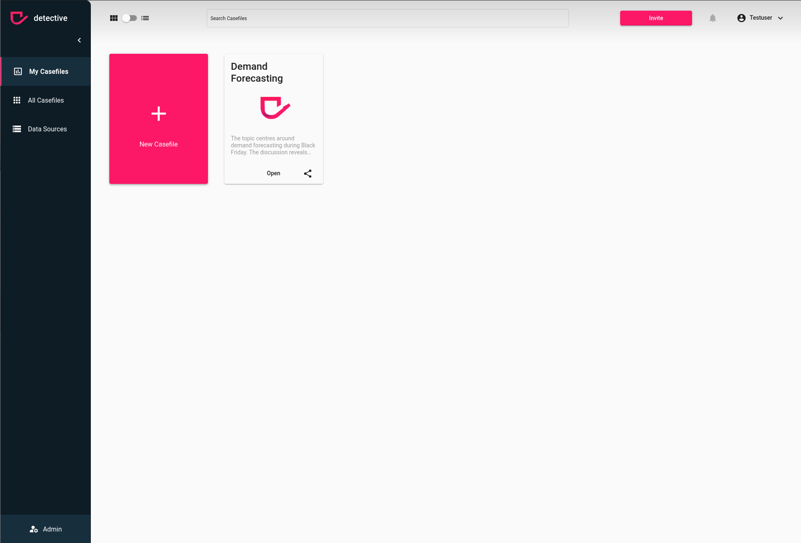

# Create a Group
To create a group of users you must first ensure the [prerequisites](../groups.html). Once you have the permission to create, delete or update a group you can press the `New Group` button at the left top.
After clicking the button a modal will open which allows you to specify the group of users you want to create.

1. [Navigate to your Groups](../groups.html)
2. Click on the `New Group` button on the left top side
3. Enter a title, a description and users
4. Hit the `save button