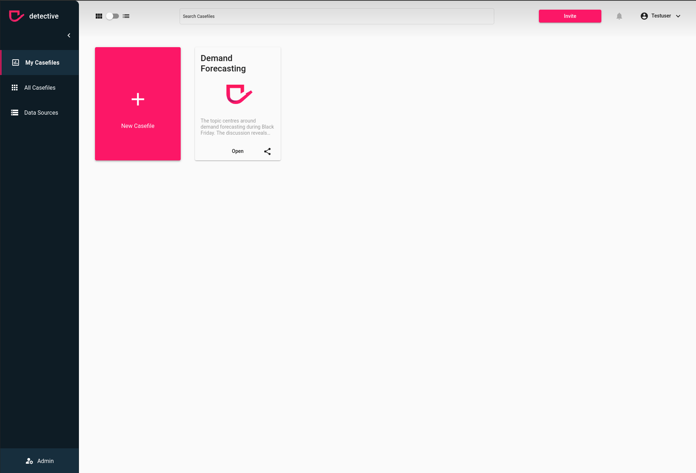

# Delete a Group
You can delete a group via the `Group` menu in the `Admin` section. However, make sure you fullfill the [prerequisites](../groups.html). 
In case you have admin rights, you can delete a group by clicking the trash icon on the right hand side of the group listing in the table.

1. Click the trash button
2. When you are sure click the button in the warning modal and the user will be removed

{: .warning }
> In case there is a [Masking](../masking.html) connected to that group it will be deleted as well and all security measures applied on the masked table will be lost. Ensure a proper replacement beforehand.