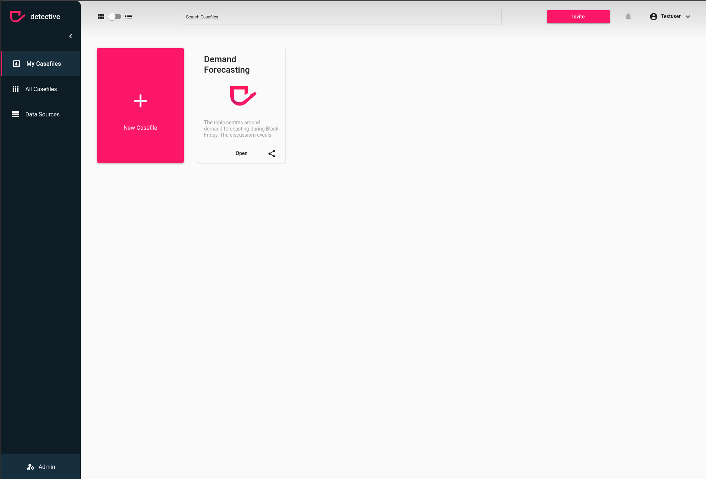

# Update a Group
You can update a group via the `Group` menu in the `Admin` section. However, make sure you fullfill the [prerequisites](../groups.html). 
In case you have admin rights, you can update a group by clicking the pen icon on the right hand side of the group listing in the table.

You can:
1. Update the tite
2. Update the description
3. Add users to the group
4. Remove users from the group

1. Click the pen button
2. Update the group
3. Hit the `Save` Button