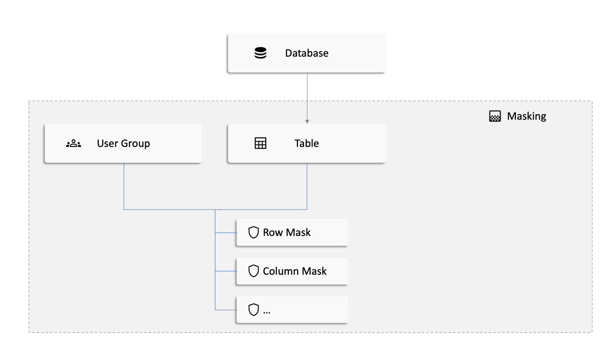

<head>
    <link rel="shortcut icon" href="{{ './assets/images/detective_logo.png' | prepend: site.baseurl | prepend: site.url }}" />
</head>
# Learn how to create a table masking
Masks allow you direct and active data protection without detours. In this section, you will learn more about the concept of masks and how you can use them for you and your organization. 

### What is a masking?
Masks can be used to specifically determine which user groups can consume certain data and how. 
For example, columns or entries can be completely hidden. For example, if sensitive information such as a person's gender should not be displayed, then the column can be made inaccessible via a mask.
Masks can be used flexibly. For example, you have the possibility to modify individual values or entire columns.

### How masking work

A masking is created for a combination of table and [user groups](./usergroups.html). 
You can create several masks for such a combination and modify them later. This way you can manage your maskings in a targeted and sorted way afterwards.

Essentially, there are two ways to mask.

1. the entire column

2. per row with value

Creating a Mask for an entire column means that a selected masking type will apply for to the entire column, while the
row mask will only mask entries with a given value. For more details please check the chapter [create masking](./masking/create.html)