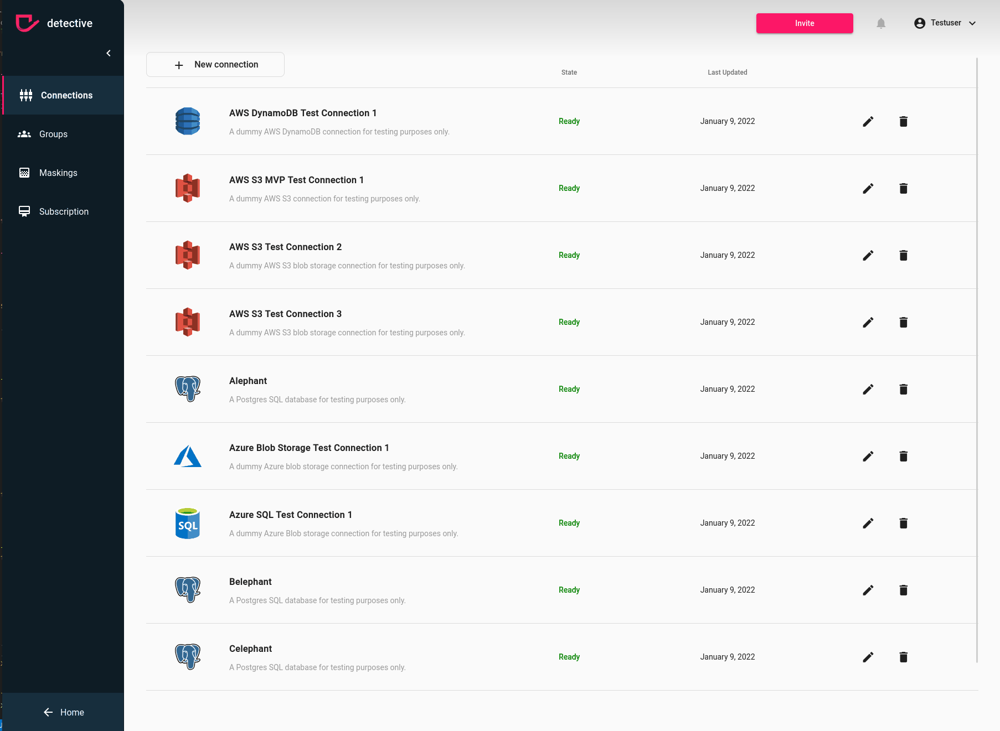
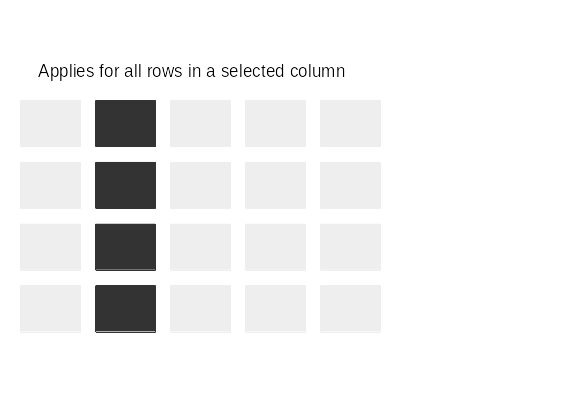
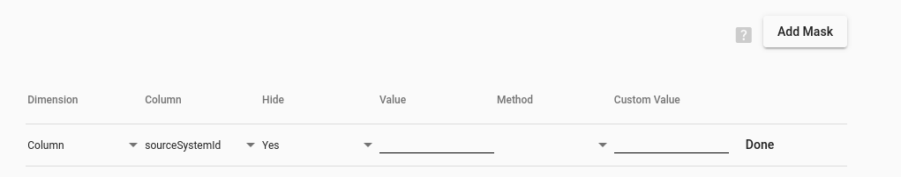
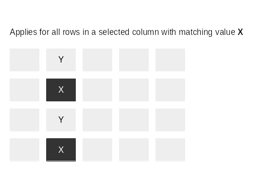
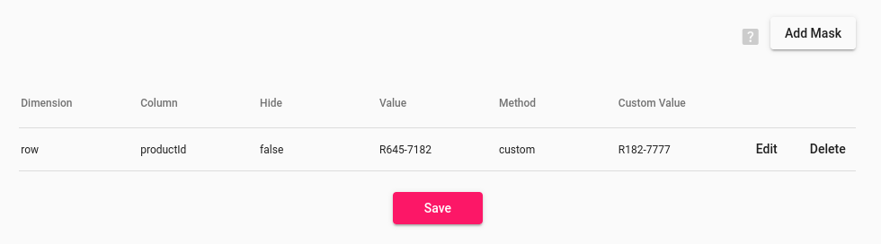

# Create Masking
Creating a masking is pretty simple, but first you need to ensure the prerequisites. 

### Prerequisites
The following points must be true:
1. Your account need administrator rights to your detective instance. If you created the detective instance you will have the admin rights by default. If you don't have admin rights ask your admin to change the subscription or ask the admin to upgrade your permissions in the [User](../users.html) section
2. You need to be logged in to [detective](https://detective.solutions/login).

### Create your Masking
Navigate to the Admin section by clicking on `Admin` in the left button corner and click on Masking in the Sidebar.
If you want to add a new masking to a table and [user group](../usergroups.html) click on `New Masking` button at the left top.
After clicking the button a modal will open which allows you to specify the masking you want to create.

1. Navigate to your Maskings
2. Click on the `New Masking` button on the left top side
3. Choose a [data source](../connections.html) from the list

Once you selected a [data source](../connections.html) the modal with give you all inputs fields required for your masking.
However, you have the option to create the masking with name and description. You don't need to add a mask right away.

### Types of Masks
You can apply masks on Column or Row dimension. You want to fill the table by hitting the
`Add Mask` button in the modal. It will add a row with input fields for you to the table.

{: .important }
> Based on the mask you want to apply you only need to use some fields

#### **Add Mask Table**

You have basically two types of Masks:
1. **Column mask**: Which will hide or mask the entire column
2. **Row mask**: Which will only hide or mask a value within a column

Based on what you choose the fields you need to fill differ. You have the following columns:

| Column       | Description                                                                                            | Required for Column Mask | Required for Row Mask |
|:-------------|:-------------------------------------------------------------------------------------------------------|--------------------------|-----------------------|
| Dimension    | Defines if you apply a mask to the entire column or just rows with a value                             | yes                      | yes                   |
| Column       | Is the name of the column you want to hide or mask                                                     | yes                      | yes                   |
| Hide         | Lets you choose weather you want to hide the entire column or row                                      | yes                      | yes                   |
| Value        | Put your value for the row filter in here                                                              | no                       | yes                   |
| Method       | Is the method of masking (more below)                                                                  | yes                      | yes                   |
| Custom Value | Only need to be filled if you choose the custom method. It allows you to define a custom value to show | (*yes)                   | (*yes)                |

*If Method is custom

---

#### **Column Mask**
A column mask will be applied to the entire column without exceptions for any values in that column.

If you want to hide the column completely you can choose a column name and answer `hide` with `yes`.

In case you want to display the column but not with its real values you have multiple options to replace values in a column based on its content:

| Method         | Description                                                            |
|:---------------|:-----------------------------------------------------------------------|
| full           | displays the column but with `****`  for each value                    |
| full email     | displays the column but with `****@****` for each value                |
| credit card    | displays the column but with only the last for digits                  |
| provider email | replaces only everything before the `@` symbol (e.g. `****@gmail.com`) |
| phone number   | creates a random phone number for the column                           |
| postal code    | displays random postal codes for the column                            |

{: .important }
> You will see more options in the dropdown menu, make sure to not switch them with the options for the rows described below.

----

#### **Row Mask**
A row mask will be applied to each row of a column that matching a given value.

If you want to hide the column completely you can choose a column name and answer `hide` with `yes`.
In case you want to display the column but not with its real values you have multiple options to replace values in a column based on its content:

| Method                | Description                                                       |
|:----------------------|:------------------------------------------------------------------|
| single name           | replaces the value with a random name                             |
| first- and last name  | creates a random first and last name to replace the value         |
| email                 | creates a random email to replace the value                       |
| address               | creates a random address to replace the value                     |
| streetname and number | creates a random streetname and house number to replace the value |
| full address          | creates a full address to replace the value                       |
| decimal               | creates a random decimal to replace the value                     |
| number                | creates a random number to replace the value                      |

{: .important }
> If you want to mask multiple values in one column you will need to create a separate mask for each value

If you want to apply a custom row mask it could look for example like this:

