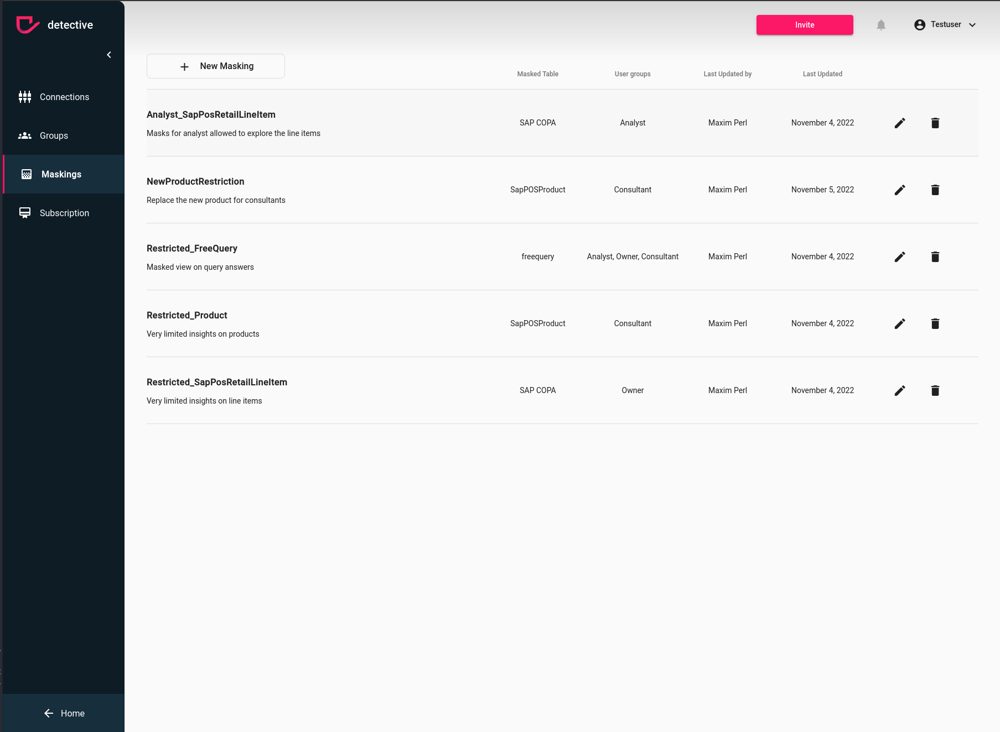

# Delete Masking
Deleting a masking is quite straight forward, however first you need to ensure the prerequisites. 

### Prerequisites
The following points must be true:
1. Your account need administrator rights to your detective instance. If you created the detective instance you will have the admin rights by default. If you don't have admin rights ask your admin to change the subscription or ask the admin to upgrade your permissions in the [User](../users.html) section
2. You need to be logged in to [detective](https://detective.solutions/login).

### Delete your Masking

If you want to delete just a single mask within your masking construct make sure to check out how to [update you masking](./update.html).
However, if you want to get rid of the whole thing, all you need to do is clicking on the trash icon on the right hand side of the masking.
A dialog will pop up and if you click the confirm button you the masking will be deleted.

{: .warning }
> Once deleted, masks will no longer be applied to data and casefiles. That means also for old casefiles masks won't be applied to data when reloading
