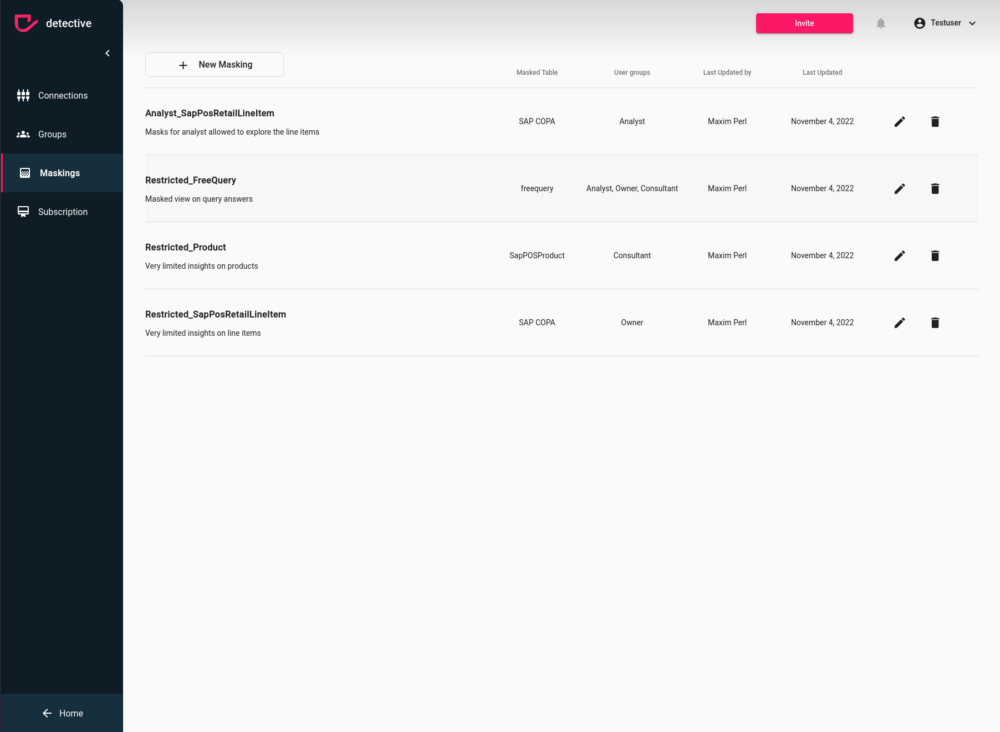

# Update Masking
Updating you masking can be done in just a few steps The only thing you need to do first ist to ensure the prerequisites.

### Prerequisites
The following points must be true:
1. Your account need administrator rights to your detective instance. If you created the detective instance you will have the admin rights by default. If you don't have admin rights ask your admin to change the subscription or ask the admin to upgrade your permissions in the [User](../usergroups.html) section
2. You need to be logged in to [detective](https://detective.solutions/login).

### Update your Masking

To update you existing masking you can click on the pen icon on the right hand side of your masking.
A dialog will your existing values will open which you can modify directly.

{: .important }
> You won't be able to modify the table or the user group, since those a fixed for a masking

You can modify the name and description of the masking by just typing into the box.
You can add a new mask by clicking on `Add Mask` or modify the masks you configured, just click the `Edit` button on the right hand side.
Furthermore, you can delete a mask by clicking the `Delete` button. 

{: .warning }
> Once deleted, masks will no longer be applied to data and casefiles. That means also for old casefiles masks won't be applied to data when reloading

