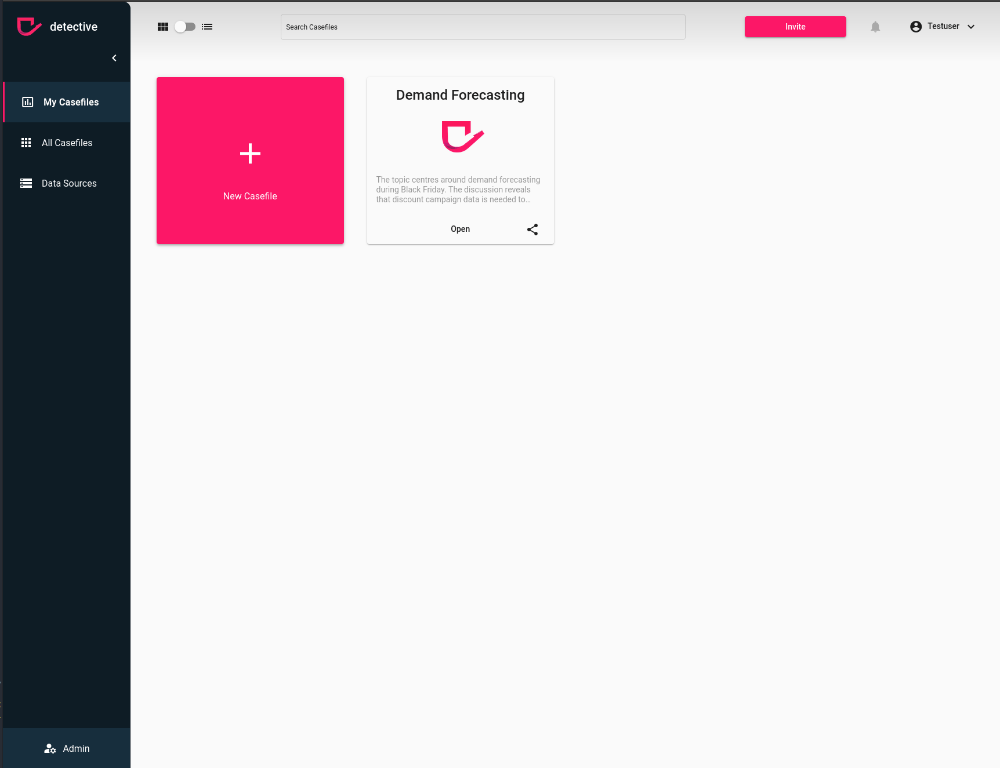

# Learn how to manage your subscription
After creating a subscription you might want to make changes afterwards. You can easily do that within your detective account.

### Prerequisites
In order to make changes, the following points must be true:
1. Your account need administrator rights to your detective instance. If you created the detective instance you will have the admin rights by default. If you don't have admin rights ask your admin to change the subscription or ask the admin to upgrade your permissions in the [User](./users) section
2. You need to be logged in to [detective](https://detective.solutions/login).

### Navigate to your subscription
To access the administration of your subscription you have to navigate to the subscription page via the admin page.

