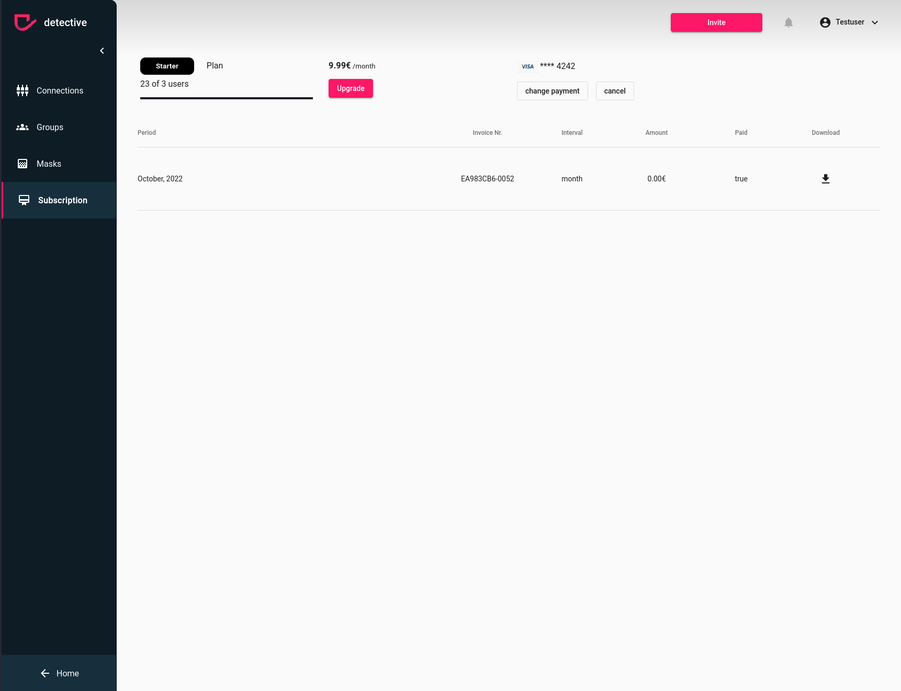

# Cancel your subscription
You can cancel your subscription at any time. To be able to cancel your
subscription ensure the [prerequisites](../subscription.md). In case you have admin rights, you can cancel your
subscription by clicking the cancel button.

1. Click the cancel button
2. Press the unsubscribe button in the modal if you are sure to cancel your subscription

### How to cancel your subscription

{: .important }
> After you canceled your subscription you still have access till the end of your subscription period.