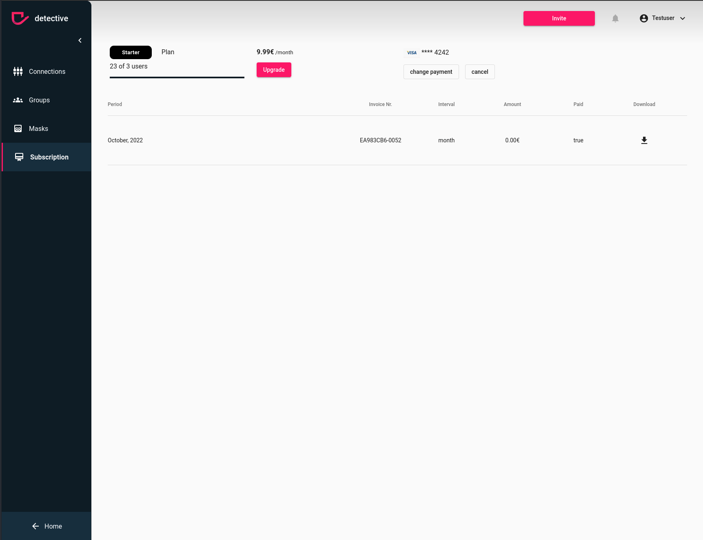

# Change your payment details
Sometimes you need to change your payment details. You can easily do that within detective. To be able to change your
payment information ensure the [prerequisites](../subscription.md). In case you have admin rights, you can change your payment information
by clicking the "change payment" button.

1. Click the "change payment" button
2. A new window will open where you can change your payment details

### How to change your payment details

