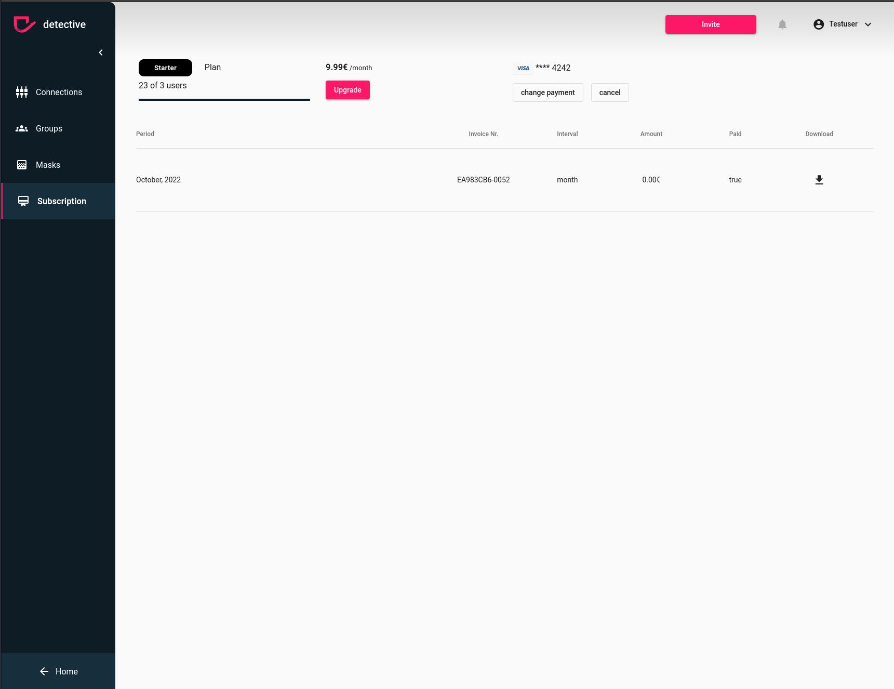

# Download your invoices
Let's be honest, sometimes we loose overview of our mail inbox. In case you missed out one of our emails
with an invoice you can still download them anytime from the subscription area. To do that you need the admin rights from the [prerequisites](../subscription.md). In case you have admin rights, you can download your invoices directly
from the invoice table

1. Search for the right billing cycle
2. Click the download button on the right hand side
3. It will download the original invoice as pdf and store it in your local downloads folder

### How to change your payment details

