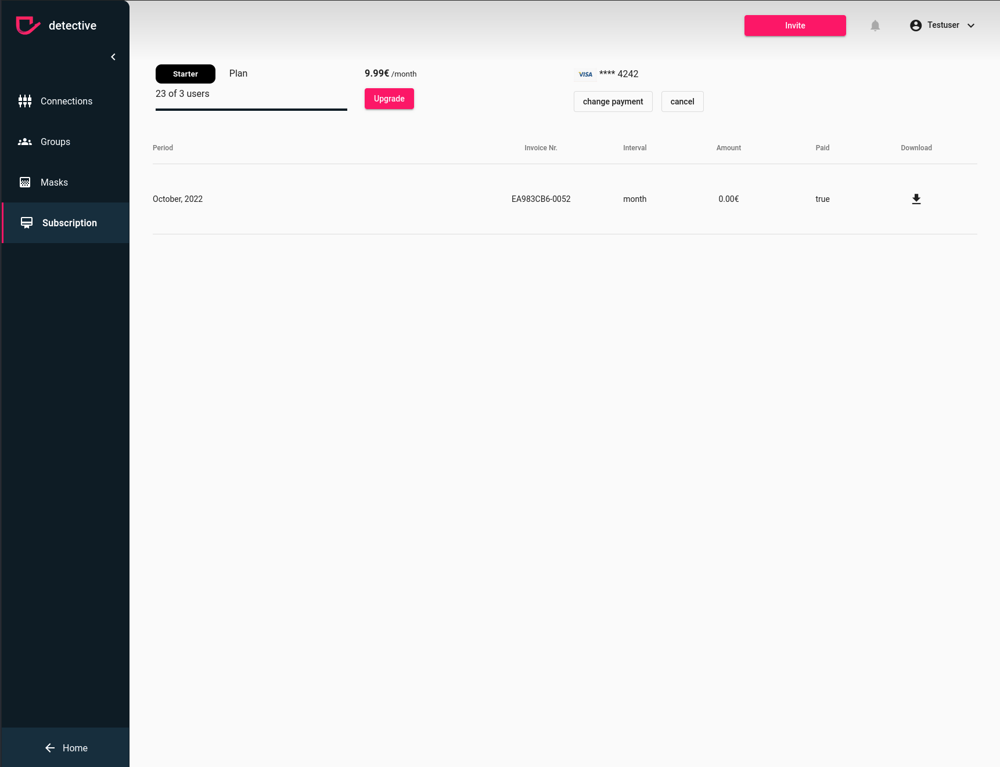

# Update your subscription
You can upgrade or downgrade your subscription at any time. To be able to change your
subscription ensure the [prerequisites](../subscription.md). In case you have admin rights, you can up- or downgrade your
subscription by clicking the highlighted upgrade button.

1. Click the Upgrade button
2. Select the right subscription for you

### How to up- and downgrade your subscription

{: .warning }
> If you downgrade your subscription some of your users might lose access in case the limit of allowed users is reached. You can manage this in your users menu

{: .warning }
> After changing your subscription it might take some time before you can switch again, so be careful and mindful before making changes.

