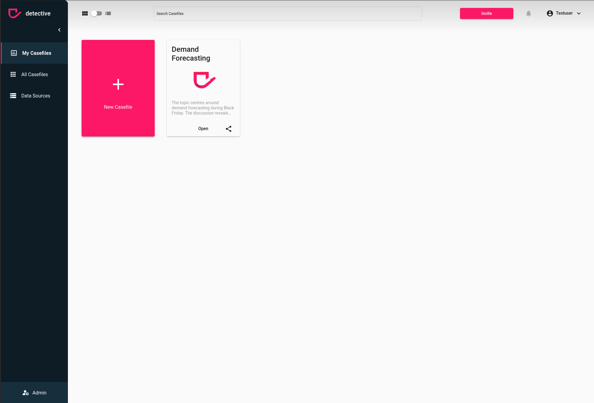

# Update a users role
In case you want to update a user from your workspace you can simply do that via the User menu in the `Admin` section. However, please ensure the [prerequisites](../users.html).

### How a user role
To update a user Role you need to navigate to the admin section with the button on the left button corner and select the `User` menu on the left hand sidebar. In the list of users you can choose the user to be changed an click on the pen icon to edit the user. Select the role in the dropdown menu you want to assign to this user and hit `Save`. That's it.

1. Click the pen (edit) button
2. Select a role from the dropdown
3. Click `save`

